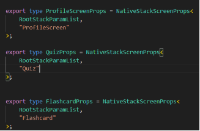
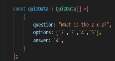
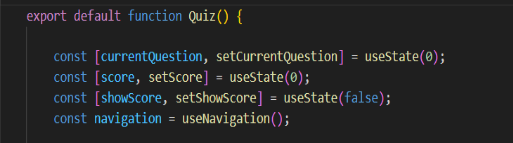
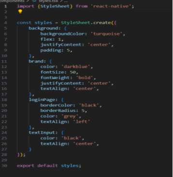
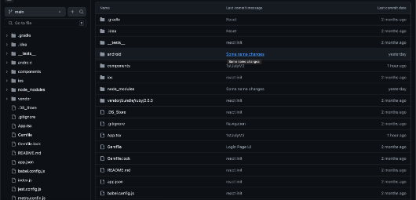
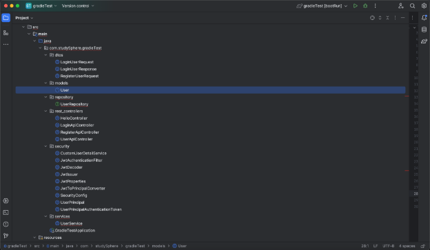
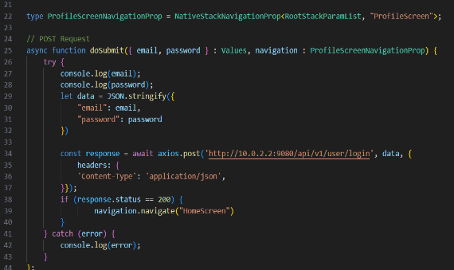
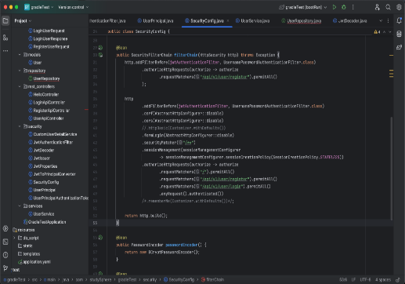
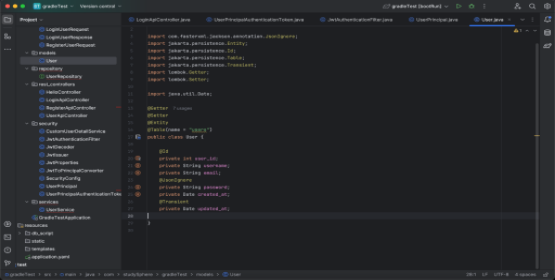

# **README**

## **Team Name**

StudySphere

## **Proposed Level of Achievement**

Apollo 11

## **Project Scope**

Study Buddy is a cutting-edge mobile application designed to enhance student collaboration and academic success. Upon registering and logging in securely with authentication features, users are greeted with a user-friendly homepage that serves as a gateway to a range of powerful educational tools.

The app's standout feature is its algorithm-driven study buddy matchmaking system. By leveraging a profiling survey, Study Buddy pairs users with compatible study partners based on shared academic interests, study habits, and availability. Study Buddy pairs users through a simple profiling survey which gets data such as the course the user is studying and how available they are. This fosters productive collaborations and encourages peer learning.

Users can upload and share study materials easily through our cloud function within the app. This sharing capability promotes knowledge exchange and supports collaborative study sessions, whether in-person or virtual.

To aid in effective learning management, Study Buddy allows students to create personalised study plans and set academic goals. The app's integrated flashcard and quiz features further enrich the learning experience by offering interactive tools for self-assessment and knowledge retention.

Additionally, Study Buddy includes a robust review and rating system, empowering users to provide feedback on study sessions, shared notes, and study partners. This ensures quality control and helps build a trusted community where students can rely on each other for academic support and growth.

Overall, Study Buddy not only facilitates efficient study group formation and resource sharing but also cultivates a supportive learning environment where students can thrive academically and achieve their educational goals with confidence.

## **Motivation**

Study Buddy aims to revolutionise how students collaborate and learn together in today's dynamic educational landscape. By bridging the gap between traditional classroom learning and digital collaboration, Study Buddy empowers students to seamlessly connect, share knowledge, and support each other in their academic journeys. Whether it's organising study groups, coordinating project work, or sharing essential study materials, Study Buddy provides a centralised platform where students can efficiently collaborate and brainstorm ideas.

Moreover, Study Buddy enhances learning effectiveness with interactive features like flashcards and quizzes, fostering deeper comprehension and retention of course material. Students can create personalised study sessions, exchange notes, and engage in real-time discussions, thereby cultivating a vibrant community of learners. With intuitive tools and a user-friendly interface, Study Buddy not only facilitates academic success but also cultivates a supportive environment where students can thrive together, making learning a collaborative and enriching experience.

## **Aim**

We hope to help students find support groups that can help each other academically as well as make friends in school.

## **User Stories**

As a student, I want to be able to find a friend who I am compatible with and can work with, so that I can excel in my studies and maintain a good balance between studying and relaxing.

As a student, I want to be able to find a study/ support group to grow and learn from each other, and to ask questions and learn from discussion, so that I can study better.

As a self-directed learner who prefers to study alone, I would want to be able to access materials that can help me improve on my work and resources to enhance my understanding of my content and concepts.

As a motivated student, I would want to set objectives for my academics so that I can pace myself in my studies.

As an organised student, I want to study and review important concepts and terms so that I can be fully prepared for my exams.

As a student, I want to test my understanding and knowledge of the subjects I learn so that I know that I have correctly grasped the concepts I learnt.

As a student, I want to see if the study app I am about to use is credible so that I don’t waste my time on a useless app.

## **Features**

### **1. Algorithm to find the most compatible study partners using a profiling survey result**

StudySphere will allow interested users to take a survey that consists of questions relating to their field of study, specialisation, study habits, ideal study conditions and personality etc. This survey will then be used to generate a user profile which will be used to match with other users. Users will be sorted based on their field of study and the algorithm will match them such that users can find the most compatible study partner.

Matched users will then be able to communicate with each other by providing their contacts as well as schedule times to study together.

### **2. Allow users to upload and share notes with each other**

Users can manually upload their notes onto the cloud in our app and can opt to share them with their friends or open it to the public. Users have the option to manually upload their notes onto the app's cloud storage, ensuring accessibility and security. Whether writing notes directly within the app or uploading existing PDF files, Study Buddy accommodates various note-taking preferences. This flexibility empowers students to collaborate effectively, share valuable study resources, and enhance their learning experiences through shared knowledge and collective effort.

This frontend will be mainly built using ReactJS and TypeScript. Our backend here would involve the framework of SpringBoot using Java and Firebase as our preferred data storage solution. Firebase offers real-time database capabilities and robust file storage options, making it ideal for handling content like study materials. Our server-side and frontend will interact through HTTP requests using Axios to send requests to the API endpoints. For example, when a user uploads a PDF file of study notes, the frontend will make a POST request to the backend's endpoint designated for file uploads.

### **3. Create study plans/goal setting**

StudySphere allows students to set goals and plans within the app. They can input details such as plan title, description, start date, end date, and specific goals they want to achieve within this timeframe. Existing study plans are displayed in a list format, showing key details like title, dates, and progress. Users can click on each plan to view or edit details, adjust goals, or update progress status.

Our backend, powered by Spring Boot with Java and integrated with Firebase, StudySphere securely stores and retrieves study plans and goal settings as JSON objects. In addition, we will create RESTful API endpoints such as

POST /study-plans

GET /study-plans/{planId}

PUT /study-plans/{planId}

DELETE /study-plans/{planId}.

When a user creates or updates a study plan through the frontend, send HTTP requests (using Axios or Fetch) to the corresponding API endpoints. These requests contain JSON payloads with plan details, which the backend processes and stores in Firebase.

In addition, Firebase’s capabilities will ensure that any updates to the study plan are synchronised across all the users devices.

### **4. Flashcards**

StudySphere has another feature to manually upload flashcards to help facilitate studying, be it last minute revision or just to remember details better. Users can manually create and upload flashcards directly within the app, facilitating comprehensive subject reviews. Each flashcard allows users to input questions on one side and corresponding answers on the reverse, promoting interactive learning and effective memory recall.

Our frontend logic, using ReactJS and TypeScript, will handle the UI to display the flashcards and to handle the flipping of the flashcard. Our backend will be managed through SpringBoot with Java, leveraging Firebase for secure storage and retrieval of user-generated flashcards. HTTP requests using axios and API endpoints facilitate communication between the frontend and backend systems. When users create or update flashcards, the frontend sends POST requests to designated backend endpoints, which then handle data processing and storage in Firebase. This integration ensures that users can access their flashcards across devices, share them with study partners, and benefit from collaborative learning experiences within StudySphere.

### **5. Quizzes to test knowledge**

StudySphere offers a quiz creation feature to enhance learning. It is friendly and easy to use as users need only input a question and 4 different answers, including the correct one. ReactJS and Typescript will handle the UI for the quiz which includes a score tally which will be displayed at the end of the quiz. The frontend will also handle the display of the correct answers for the students to see and review their work. The quiz feature will include a cloud feature where students can share their created quiz with friends or to the general studySphere community. This will be handled by our backend, which will handle the POST requests, with an array of the Quiz details, from the frontend. And then our backend of SpringBoot and Java will handle this HTTP request and store the data using either SQL or Firebase. Conversely, when the frontend make a request to retrieve a quiz to the backend, the request will be handled by the logic on our server side which will retrieve the data and then allow users to access the quizzes.

### **6. Review and rating system**

Lastly, StudySphere will allow users to leave feedback on the system as well as suggest improvements to the application. This will allow us to meet the needs of the users and improve the application accordingly. Users will also be able to report vulnerabilities to us, which we will then be able to act upon and rectify.

Additionally, users can rate the application on a scale of 5 stars, as well as leave their comments on their experience using StudySphere. This can give new users a sense of how well built StudySphere as well as features they are likely to use.

## **Timeline**

|    **MS**    |                                             **Task**                                             |                                                                                                                                                 **Description**                                                                                                                                                 |                                                **In-Charge**                                                |           **Date**           |
| :----------: | :----------------------------------------------------------------------------------------------: | :-------------------------------------------------------------------------------------------------------------------------------------------------------------------------------------------------------------------------------------------------------------------------------------------------------------: | :---------------------------------------------------------------------------------------------------------: | :--------------------------: |
|      1       |             
Poster

Video

Tech Stack 
              |                                                                                            
Initialising

Initialising

Setting up IDEs and Installing required software
                                                                                            |              
Gareth & Jordon

Gareth & Jordon

Gareth & Jordon
               |       13 May - 19 May        |
|              |      
Tech Stack

UI/UX

Backend
       |                                                                       
Setting up and linking Github Repo

Resolving linkage issues

Setting up

Implementing MySQL to store credentials
                                                                       |         
Gareth & Jordon

Gareth & Jordon

Gareth

Jordon
         |       20 May - 26 May        |
|              |       
API

Poster

Video
       |                                                                 
Setting up API to link frontend and backend

Registration and Login Feature

Finalising for MS 1

Finalising for MS 1
                                                                  | 
Jordon

Gareth & Jordon

Gareth & Jordon

Gareth & Jordon
 |        27 May - 2 Jun        |
|    1 Due     |                                                                                                  | 
Milestone 1 - Technical proof of concept (i.e., a minimal working system with both the frontend and the backend integrated for a very simple feature)

- Profiling survey able to list out potential study buddy

- Allow uploading and downloading of study notes

- Create signup/login
 |                                                                                                             |            3 Jun             |
|      2       |                                               N/A                                                |                                                                                                                                                       N/A                                                                                                                                                       |                                                     N/A                                                     | 
4 Jun - 

9 Jun
  |
|              |  
Spring Security

React Native

Quiz
  |                                         
Initialising Authentication, Authorization and Security Features

Encryption of Passwords in Login

Establishing Navigation Features

Setting Up and Implementation of Quiz Feature
                                          |       
Jordon

Jordon

Gareth

Gareth
        |       10 Jun - 16 Jun        |
|              |                        
NavBar

Spring Security
                         |                                                                                                        
Setting Up NavBar for Navigation

Improving Authentication and Authentication
                                                                                                         |                                  
Gareth

Jordon
                                   |       17 Jun - 23 Jun        |
|              | 
Spring Boot

FlashCard

Notes

FireBase
 |                                                             
Fixing API Controller

Implementation of FlashCard Screen

Implementation of Notes Screen

Setting Up FireBase for Notes Storing and Sharing
                                                             |           
Jordon

Gareth

Gareth

Gareth
           |       24 Jun - 30 Jun        |
|    2 Due     |                                                                                                  |                                                         
Milestone 2 - Prototype (i.e., a working system with the core features)

- Increase/optimise accuracy of profiling survey

- Enable users to create study plans and set goals
                                                          |                                                                                                             |     
1 Jul

      |
|      3       |                                               TBC                                                |                                                                                                                                                       TBC                                                                                                                                                       |                                                     TBC                                                     |  
2 Jul -

7 Jul
  |
|              |                                               TBC                                                |                                                                                                                                                       TBC                                                                                                                                                       |                                                     TBC                                                     | 
8 Jul -

14 Jul
  |
|              |                                               TBC                                                |                                                                                                                                                       TBC                                                                                                                                                       |                                                     TBC                                                     | 
15 Jul -

21 Jul
 |
|              |                                               TBC                                                |                                                                                                                                                       TBC                                                                                                                                                       |                                                     TBC                                                     | 
22 Jul -

28 Jul
 |
|    3 Due     |                                                                                                  |                                                            
Milestone 3 - Extended system (i.e., a working system with both the core + extension features)

- Have working Flashcard and Quiz system as well as review and rating system
                                                             |                                                                                                             |            29 Jul            |
|              |                                               TBC                                                |                                                                                                                                                       TBC                                                                                                                                                       |                                                     TBC                                                     | 
30 Jul -

4 Aug
  |
|              |                                               TBC                                                |                                                                                                                                                       TBC                                                                                                                                                       |                                                     TBC                                                     | 
5 Aug -

11 Aug
  |
|              |                                               TBC                                                |                                                                                                                                                       TBC                                                                                                                                                       |                                                     TBC                                                     | 
12 Aug -

18 Aug
 |
|              |                                               TBC                                                |                                                                                                                                                       TBC                                                                                                                                                       |                                                     TBC                                                     |       19 Aug - 25 Aug        |
| Splash- down |                                               TBC                                                |                                                                                                                                                       TBC                                                                                                                                                       |                                                     TBC                                                     |       26 Aug - 29 Aug        |

## **Tech Stack**

React Native - Mobile App Development

NodeJS - API

MySql & Firebase - Database

Java - Backend

GitHub - Version Control

## **Qualifications**

CS50

CS2030

CS2040S

Courses in Python and Web Programming

## **Software Engineering Practices**

In developing the Study Buddy app, several good practices in software engineering have been implemented to ensure the code is maintainable, scalable, and efficient:

### 1. **Component-based Architecture**: The application is structured using reusable components such as Flashcard and Quiz. Each component encapsulates its own logic and UI, promoting modularity and making the code easier to maintain and extend.

2. **Type Safety with TypeScript**: The use of TypeScript for defining types like FlashcardProps and QuizData enhances type safety. This practice helps catch type mismatches during development, reducing the likelihood of runtime errors and improving code reliability.

### 3. **State Management with useState**: State is managed using React's useState hook for various functionalities like flipping flashcards and tracking quiz progress. This functional approach simplifies state management, avoids the complexities of class components, and enhances code readability.

### 4. **Navigation with React Navigation**: Navigation between different screens is handled using React Navigation's createNativeStackNavigator. This provides a structured way to manage app flow and screen transitions, improving the user experience and maintaining a clean navigation structure.

![ref1]

### 5. **Styling with StyleSheet**: Styles are defined using StyleSheet.create, ensuring that styling is scoped and optimised. This approach enhances performance by avoiding inline styles and makes the styling code more readable and maintainable.

### 6. **Using version Management:** The project employs version control using Git, enabling effective collaboration, tracking of changes, and rollback to previous versions if necessary. This practice ensures that the codebase is well-managed and that development progresses smoothly without the risk of losing work.

### 7. **Using Model-View-Controller:** By separating the application into models, views, and controllers, we have organised the code to enhance readability and maintainability. The model represents the data and business logic, the view handles the presentation layer, and the controller processes user inputs and updates the model and view accordingly. In addition we have services, data-transfer-objects as well as security features incorporated.

### 8. **API Integration:** The application integrates with backend services through well-defined API endpoints. This allows for efficient communication between the frontend and backend, enabling functionalities such as data fetching, user authentication, and storage of user-generated content. API integration ensures that the app can interact with external services and databases, providing dynamic and up-to-date information to users.

### 9. **Abstraction:** The application employs abstraction to hide complex implementation details and expose only necessary functionalities. This is achieved through the use of hooks, higher-order components, and context APIs. Abstraction reduces complexity, enhances code readability, and makes it easier to manage and update the application.

The navigation logic is abstracted into a centralised App.tsx file. This keeps the navigation setup separate from the actual screen components, making the code more organised and easier to manage

![ref2]

App.tsx File

### 10. **Authentication & Authorization:**

Token-Based Authentication: The use of JWT (JSON Web Tokens) for authentication ensures a secure, stateless mechanism for verifying user identities, minimising the risk of session hijacking and providing a scalable solution for modern web applications.

Carefully disabling CSRF and CORS protections where appropriate for a stateless API ensures security without compromising the flexibility and usability of the application.

### 11. **Encapsulation:** Through defining getters and setters in our backend code, we maintain better control of class attributes and methods, as it is easier to change a part of the code without having to alter everything else.

[ref1]: readmeimages/readMeImage_004.png
[ref2]: readmeimages/readMeImage_009.png
